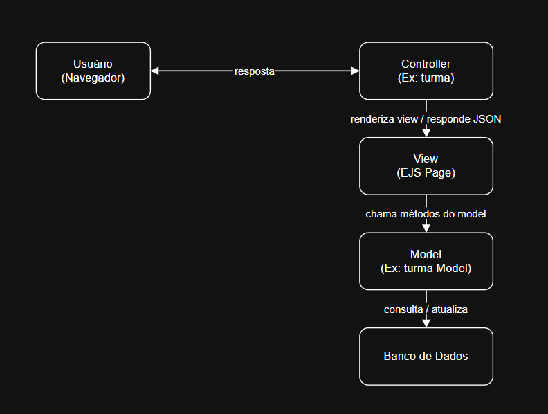
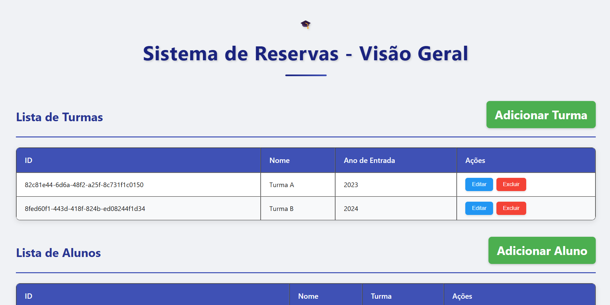
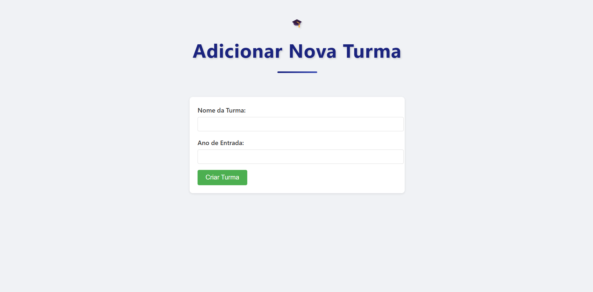
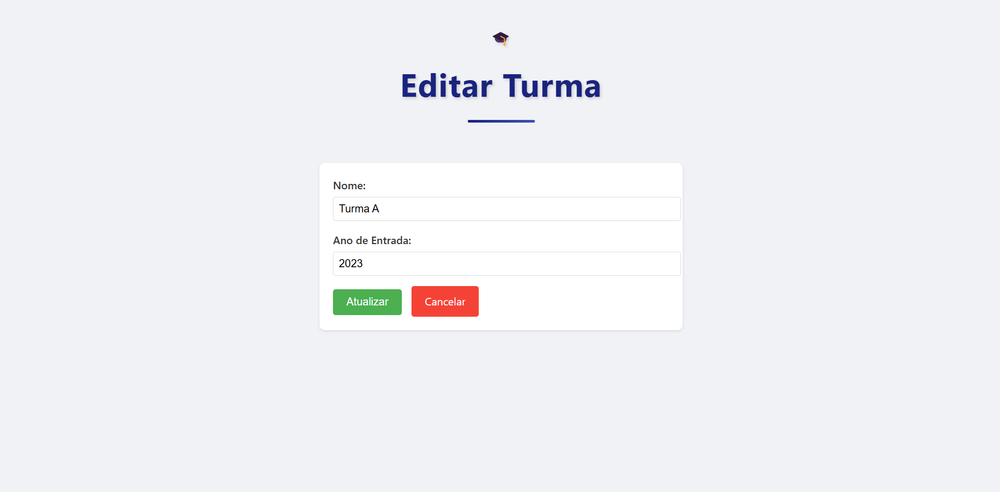

# WAD - Web Application Document - Módulo 2 - Inteli


## Projeto Pessoal - Reserva de Salas


## Sumário

1. [Introdução](#c1)  
3. [Modelagem do banco de dados](#c2)  
4. [Desenvolvimento da Aplicação Web](#c3)  
5. [Referências](#c4)  

<br>

## <a name="c1"></a>1. Introdução (Semana 01)

Será desenvolvido um sistema para gerenciar a reserva e a utilização de salas de forma otimizada e estruturada. A aplicação permite a verificação em tempo real da disponibilidade dos espaços, a realização de reservas e o acompanhamento do uso dos ambientes. Projetado para atender demandas de controle e agendamento em empresas, instituições de ensino, coworkings e demais ambientes com uso compartilhado de salas.

Esse sistema pode ser modificado para diferentes usos, mas nesse projeto o foco será o desenvolvimento de uma plataforma para o Inteli, utilizando as informações da faculdade para gerir o banco de Dados. Para os alunos serão utilizados dados fictícios gerados por IA.

---

## <a name="c2"></a>2. Modelagem do banco de dados

### 2.1. Modelo Relacional  (Semana 3)

# Diagrama do Banco de Dados

Este diagrama mostra o relacionamento entre as entidades: turma, aluno, grupo, salas, reservas e a tabela associativa aluno_grupo.

<div align="center">
  
  <p><sub>Fonte: Material produzido pelo autor (2025)</sub></p>
</div>

# Modelo de Dados da Aplicação

O esquema abaixo representa o modelo relacional do banco de dados em DBML:

```dbml
Table aluno { 
  id integer [primary key]
  nome varchar
  id_turma varchar [not null, ref: > turma.id]
}

Table aluno_grupo {
  id integer
  id_aluno integer [not null, ref: > aluno.id]
  id_grupo integer [not null, ref: > grupo.id]
}

Table grupo {
  id integer [primary key]
  nome varchar
  quantidade integer
}

Table turma {
  id integer [primary key]
  nome varchar
  ano_de_entrada integer
}

Table salas {
  id integer [primary key]
  capacidade integer
  nome varchar
}

Table reservas {
  id integer [primary key]
  sala_id integer [not null, ref: > salas.id]
  id_aluno integer [not null, ref: > aluno.id]
  id_grupo integer [not null, ref: > grupo.id]
  reservado timestamp
  começo timestamp
  fim timestamp
}
```

### 2.1.1 BD e Models (Semana 5)
O model Turma representa a entidade de turma no sistema, responsável por armazenar informações sobre as turmas cadastradas, como nome e ano de entrada. Ele faz a interface entre a aplicação e o banco de dados para todas as operações relacionadas às turmas.

### 2.2. Arquitetura (Semana 5)

<div align="center">
  
  <p><sub>Fonte: Material produzido pelo autor (2025)</sub></p>
</div>


### 2.3. WebAPI e endpoints (Semana 05)

O sistema possui os seguintes endpoints organizados por entidade:

#### Turmas
- `GET /turmas`: Lista todas as turmas cadastradas
- `GET /turmas/:id`: Obtém detalhes de uma turma específica
- `POST /turmas`: Cria uma nova turma
- `PUT /turmas/:id`: Atualiza dados de uma turma existente
- `DELETE /turmas/:id`: Remove uma turma do sistema

#### Alunos
- `GET /alunos`: Lista todos os alunos cadastrados
- `GET /alunos/:id`: Obtém detalhes de um aluno específico
- `POST /alunos`: Cadastra um novo aluno
- `PUT /alunos/:id`: Atualiza dados de um aluno existente
- `DELETE /alunos/:id`: Remove um aluno do sistema

#### Grupos
- `GET /grupos`: Lista todos os grupos
- `GET /grupos/:id`: Obtém detalhes de um grupo específico
- `POST /grupos`: Cria um novo grupo
- `PUT /grupos/:id`: Atualiza informações de um grupo
- `DELETE /grupos/:id`: Remove um grupo do sistema

#### Salas
- `GET /salas`: Lista todas as salas disponíveis
- `GET /salas/:id`: Obtém detalhes de uma sala específica
- `POST /salas`: Cadastra uma nova sala
- `PUT /salas/:id`: Atualiza informações de uma sala
- `DELETE /salas/:id`: Remove uma sala do sistema

#### Reservas
- `GET /reservas`: Lista todas as reservas
- `GET /reservas/:id`: Obtém detalhes de uma reserva específica
- `POST /reservas`: Cria uma nova reserva
- `PUT /reservas/:id`: Atualiza uma reserva existente
- `DELETE /reservas/:id`: Cancela uma reserva

#### Associação Aluno-Grupo
- `GET /aluno-grupo`: Lista todas as associações entre alunos e grupos
- `GET /aluno-grupo/:id`: Obtém detalhes de uma associação específica
- `POST /aluno-grupo`: Cria uma nova associação entre aluno e grupo
- `PUT /aluno-grupo/:id`: Atualiza uma associação existente
- `DELETE /aluno-grupo/:id`: Remove uma associação

#### Páginas de Interface
- `GET /`: Página inicial do sistema
- `GET /turmas/novo`: Formulário para criar nova turma
- `GET /turmas/editar/:id`: Formulário para editar turma
- `GET /alunos/novo`: Formulário para cadastrar novo aluno
- `GET /alunos/editar/:id`: Formulário para editar aluno
- `GET /grupos/novo`: Formulário para criar novo grupo
- `GET /grupos/editar/:id`: Formulário para editar grupo
- `GET /salas/novo`: Formulário para cadastrar nova sala
- `GET /salas/editar/:id`: Formulário para editar sala
- `GET /reservas/novo`: Formulário para criar nova reserva
- `GET /reservas/editar/:id`: Formulário para editar reserva

### 2.4 Interface e Navegação (Semana 07)

<div align="center">
  
  <p><sub>Página inicial com as tabelas</sub></p>
</div>

<div align="center">
  
  <p><sub>Tela para adicionar informações</sub></p>
</div>

<div align="center">
  
  <p><sub>Tela para editar informações</sub></p>
</div>

## <a name="c3"></a>3. Desenvolvimento da Aplicação Web (Semana 8)

### 3.1 Demonstração do Sistema Web (Semana 8)

[Assista ao vídeo explicando o projeto](https://youtu.be/p6p8h5mUxbY)

### 3.2 Conclusões e Trabalhos Futuros (Semana 8)

O resultado do projeto cumpre seu propósito de ser intuitivo e adaptável para qualquer um. O produto foi pensado para que o usuário final, o administrador do sistema, faça reservas com rapidez e não tenha dificuldade para entender cada elemento da página.

No futuro, poderão ser adotadas outras abordagens de design gráfico que estejam em conformidade com o guia de estilo específico do cliente. Caso necessário podem ser adicionadas novas tabelas.

## <a name="c4"></a>4. Referências

Google Forms. Disponível em: <https://docs.google.com/forms>.

‌GitHub - afonsolelis/mvc-boilerplate. Disponível em: <https://github.com/afonsolelis/mvc-boilerplate>.‌

‌Supabase. Disponível em: <https://supabase.com>.

---